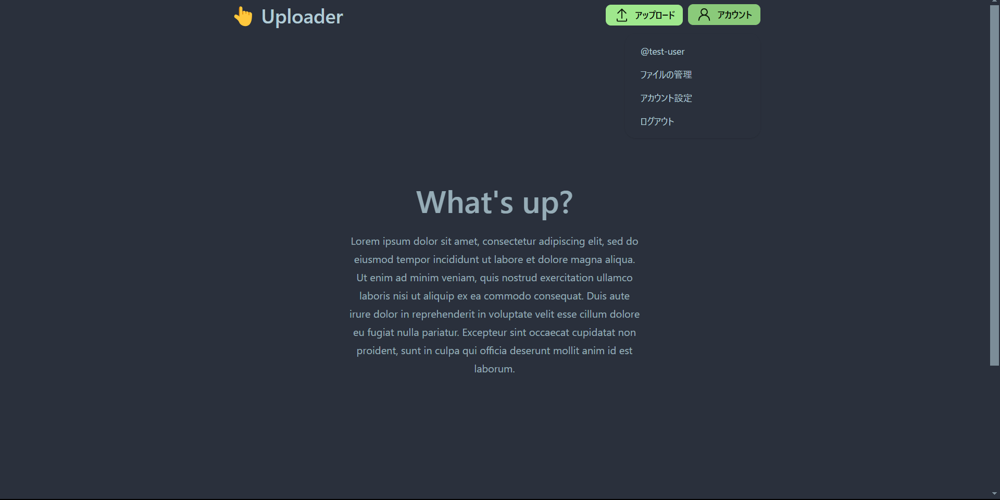
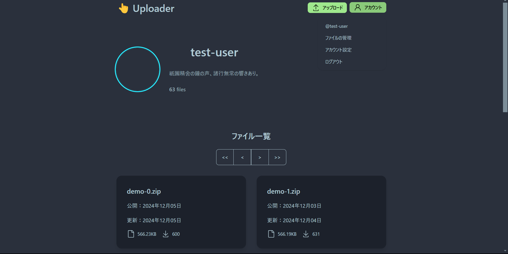
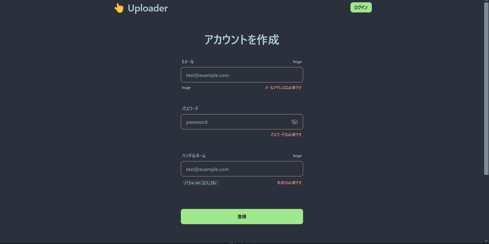
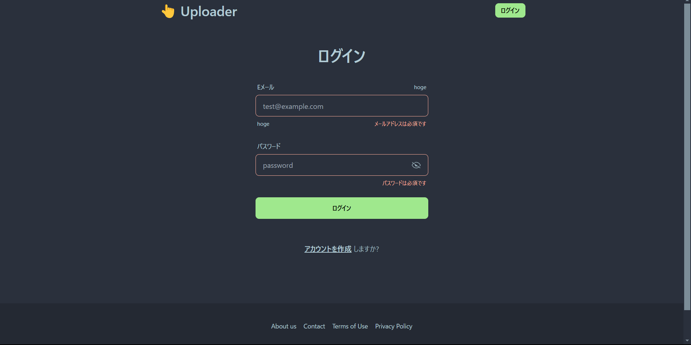
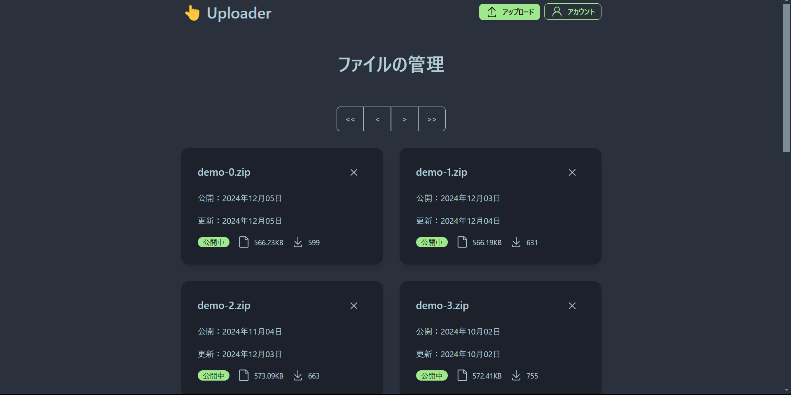
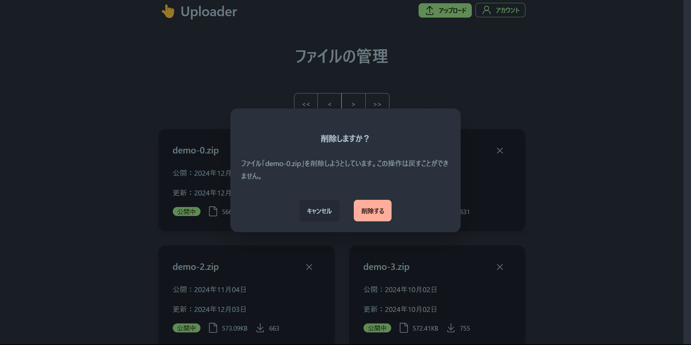
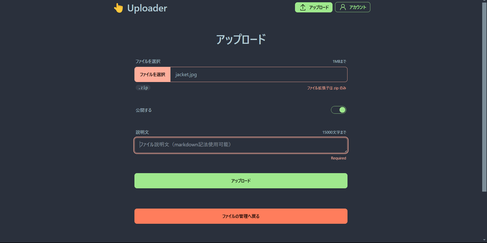
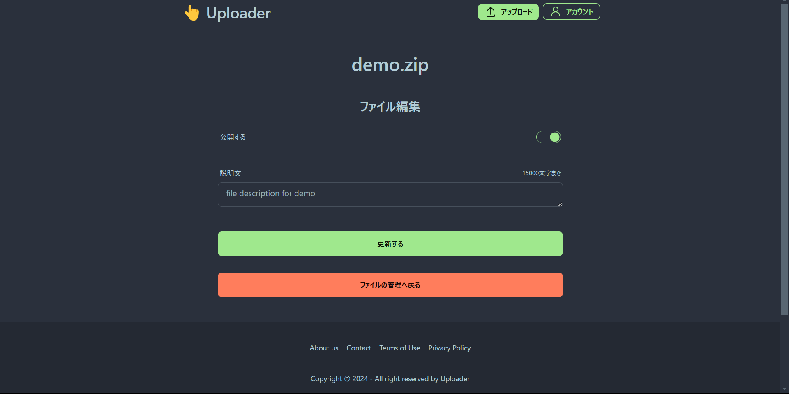
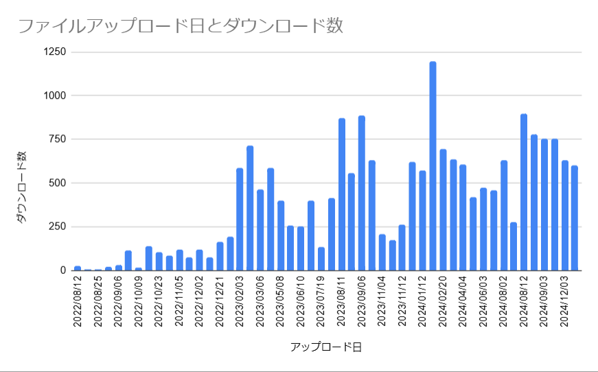

2022年8月に公開したファイルのアップロード・ダウンロードができるReact製Webアプリを、Remix製に変更しました。下は当該サイトについて2024年1月に投稿したものです。

https://oriverk.dev/blog/20240109-publish-uploader-site/

※以降、UL＝アップロード、DL＝ダウンロードと省略します。

## サービスの機能

このWebアプリは、ユーザがファイルをULし、またDL出来る仕組みを提供します。ULにはユーザ登録が必要ですが、DLはユーザ登録を必要とせず、ULした人のIDを知っている人であれば誰でもアクセス可能です。

ただし、当Webアプリは私が趣味関係で開発・メンテナンスしているJS製ツールを頒布するために作成したものなので、ユーザ登録及びファイルアップロードは私以外には出来ない様に制限しています。

- ユーザ認証機能
  - 新規登録
    - FirebaseAuthenticationを用いて、メールアドレスとパスワードでユーザ登録
    - 登録ユーザに関するその他の情報はFirebaseFirestoreに保存される
  - ログイン・ログアウト
    - 登録済みユーザはログインしてファイルを管理可能
  - セッション管理
    - セッションは一定時間で期限切れとなり、再ログインを促す
- ファイルアップロード機能
  - 認証要件
    - ULを行うためには、メールアドレスとパスワードを用いたユーザ登録とログインが必要
  - UL可能ファイル
    - 拡張子やファイルサイズに制限を設ける（`.zip`ファイルのみに制限
  - アップロード後の処理
    - ファイルはFirebaseStorageに保存される
    - ファイルのメタデータおよび説明文などはFirebaseFirestoreに保存される
- ファイルダウンロード機能
  - 認証不要
    - DLはユーザ登録不要
- ファイル管理機能
  - 個別管理
    - 各ユーザは自身がULしたファイルのみを一覧で確認し、説明文などを編集できる。
  - 削除機能
    - ユーザは自身がULしたファイルを論理削除できる

## 使用した技術

今まではファイルとその関連情報の送受信をクライアントサイドで行っていたので、Webアプリ作成にはReactの他に`Firebase Javascript SDK`や`react-firebase-hooks`を用い、FirebaseHostingにデプロイしていました。

- FW
  - React, TypeScript
    - [CSFrequency/react-firebase-hooks: React Hooks for Firebase.](https://github.com/CSFrequency/react-firebase-hooks)
    - [React Hook Form - Simple React forms validation](https://www.react-hook-form.com/)
    - [Zod | Documentation](https://zod.dev/)
    - [react-dropzone](https://react-dropzone.js.org/)
- Style
  - TailwindCSS
- Data & Hosting
  - [Firebase](https://firebase.google.com)
    - Hosting, Firestore Database, Storage

今回はRemixを用い、データの送受信をサーバサイドで行うことにしました。また、アカウント登録やファイルアップロード時のフォームバリデーションには、`conform` と `zod` を利用しました。

- FW
  - React@18
  - [Remix@2](https://remix.run/)
- Style
  - [tailwindcss](https://tailwindcss.com/)
  - [daisyUI](https://daisyui.com/)
- Validation:
  - [Conform](https://conform.guide/)
  - [Zod](https://zod.dev/)
- Data: Firebase Admin SDK
- Hosting: [Cloud Run](https://cloud.google.com/run)

プログラムなどはGitHubレポジトリを参照

https://github.com/oriverk/remix-uploader

Remixを利用したFirebaseStorageへファイルをアップロードするプログラムについては、Zennに投稿しました。

https://zenn.dev/oriverk/articles/2914b8bff52476

## スクリーンショット

スクリーンショット画像中のアカウントはデモ用アカウントですが、各UL済みファイルは実際に存在する私のアカウントがULしたファイルを名前を変えて表示しています。DL数も2024年12月13日時点の実際の数字です。

トップページ：/

ファイル一覧ページ：/\{userId\}

ユーザ登録ページ：/join

ログインページ：/login

ファイル管理ページ：/dashboard

ファイル削除ダイアログ：/dashboard

ファイルアップロードページ：/files/new

ファイル編集ページ：/files/\{fileId\}/edit

## おわりに

ユーザ登録とファイルアップロード可能なユーザを私一人に限定していると言う理由で、いくつかさぼっている所があるので、適宜修正していきたい

- TODO
  - スタイルの修正
  - アカウント削除機能の追加
  - ファイルの物理削除を可能にする
    - 現在は論理削除のみ
  - コードの統一化及び整理

また、Remixへの移行作業の途中で、Reactは＠19に、Remixは[ReactRouter@7](https://reactrouter.com/)になってしまいました。Remixに移行したばかりであるが、それらに移行したいと思っています。

頒布しているJS製ツールは1000人ほどが使っている様です。自分が楽するために作ったモノをついでに配布しているだけなので、`Cloud Run`などの費用が赤字にならなさえすれば、まあ十分です。
